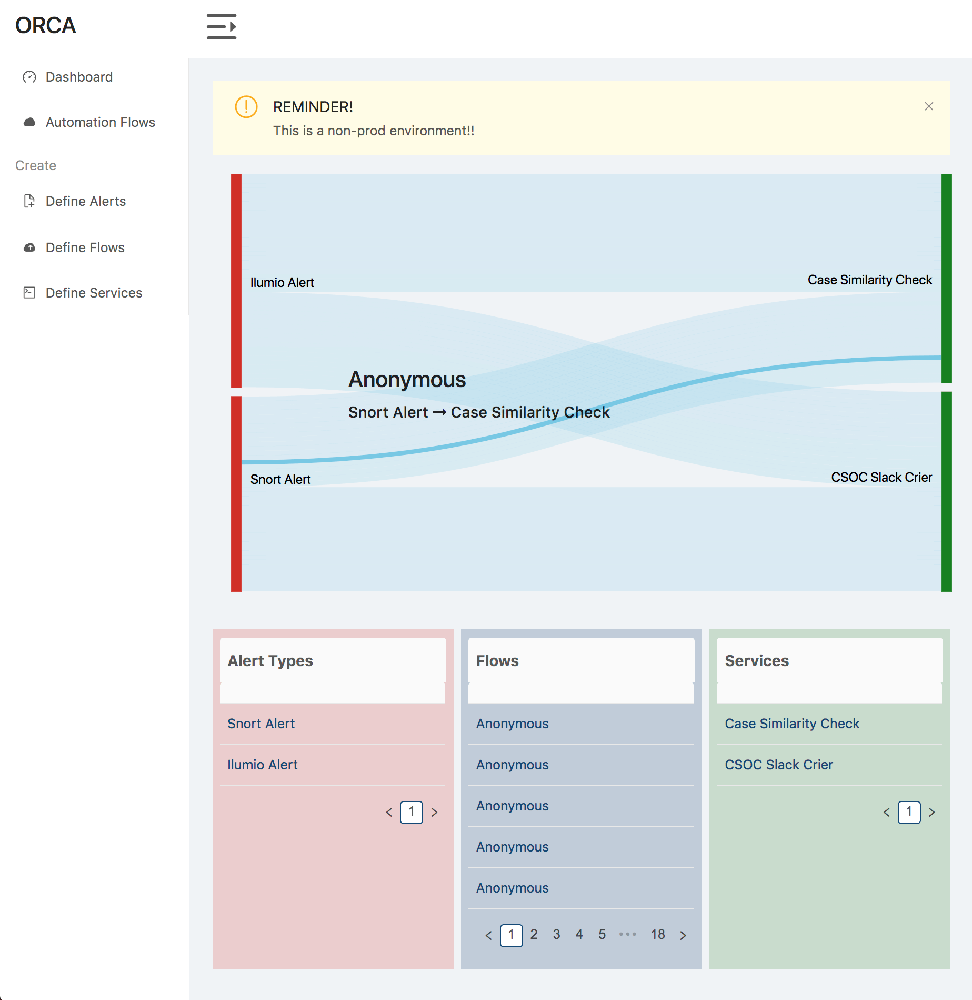
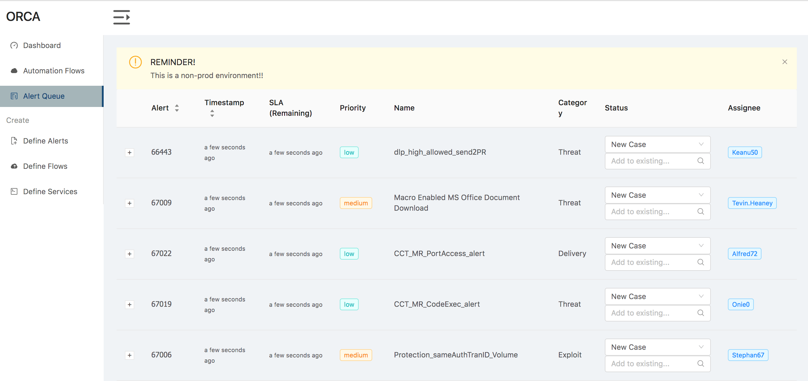
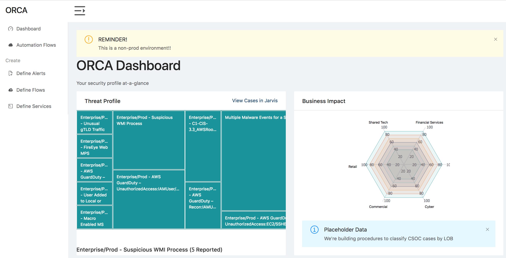

With cyber threats becoming more sophisticated and outpacing the development of security controls, the industry needs a scalable solution for automated incident response and profiling. In my time with Capital One, I developed a security automation ("DevSecOps") product as a solution. This is a full-stack web application built with Node, React and Redux that connects to a series of microservices that have been developed with Node and Python, but could use any language.

To explain the solution, I must introduce three key concepts:

### Attack Vectors

These are the kind of threats that can be identified, typically found by security alerts logged by different systems. Examples of this could be something along the lines of the following:

- __Unauthorized Root User__
- __Watering Hole Attacks__
- __Suspected login request forgery__

### Remediation Services

These are services leveraged to provide intelligence or potential resolutions for emerging threats. For example, you could:

- Terminate sessions for unauthorized users
- Inspect suspicious files with [VirusTotal](https://www.virustotal.com/)

### Workflows

The processes involved in the triage process spanning from triage to resolution. Often times these can be reduced to an "if this, then that" model:

- For __Unauthorized Root Users__, __terminate__ their sessions
- Given a __Suspicious File__, __inspect it__

# The Solution
### The Security Orchestration Engine

The Security Orchestration Engine allows users to define **Vectors**, **Services**, and the **Workflows** between the two. This allows security analysts to build-or-buy automation services and automatically route incoming threats to them in real time, effectively automating the process as defined.

The engine is defined to allow analysts to create their own use cases, and thus isn't constrained to any particular platform, framework, or system model. It is also organizationally liberating, allowing teams to write their automation solutions with any language or framework they prefer.

This system ties directly with other SIEM solutions, allowing cases to automatically be updated based on workflow results. Workflows can be configured to either run automatically, or be queued up as "suggested" tasks.

## Additional Value

This system leverages a veritable goldmine of actionable data - by profiling threats as they occur, you can effectively map out the threat landscape and risk across an organization. This was very well received and ends up offering immense value to security teams and executives.

---

## Closing Notes

This is the extent to which I am at liberty to discuss this project.
Please do not contact me for more details about this specific IP.
